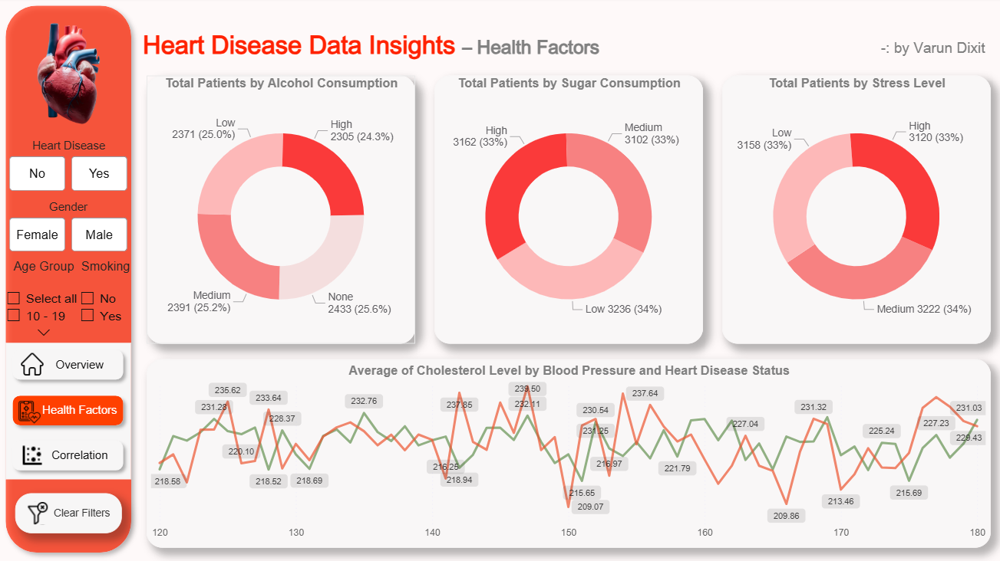
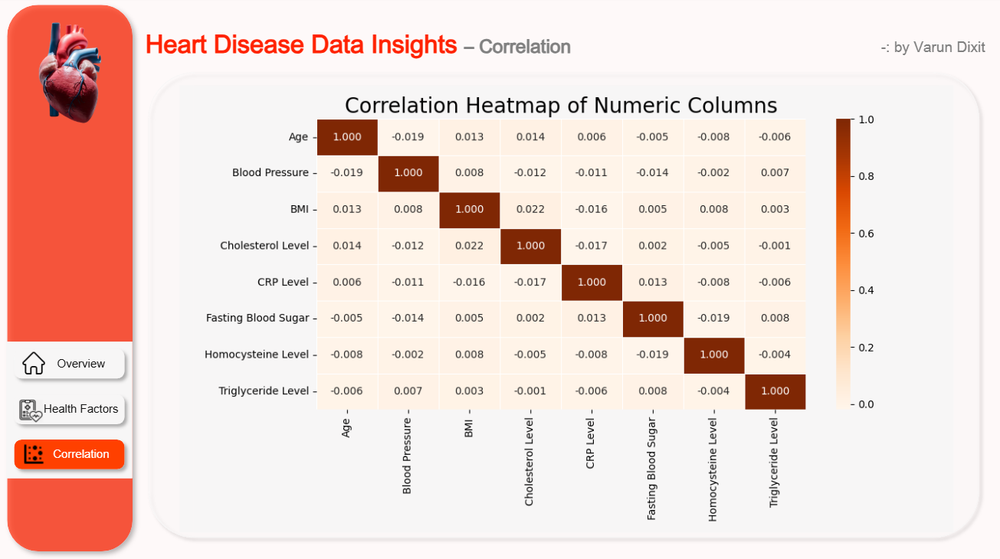

<h1>Heart Disease Data Insights Dashboard</h1>

This repository contains an interactive Power BI dashboard designed to analyze heart disease data.
The project provides visual insights into patient demographics, health factors, and relationships
between major medical indicators.

<h2>📊 Dashboard Pages</h2>

<h3>1. Overview Page</h3>

<h3>2. Health Factors Page</h3>

<h3>3. Correlation Page</h3>

<h2>📁 Files Included</h2>
<ul>
  <li><b>Heart_Disease_Data_Insights.pbix</b> – Main Power BI dashboard</li>
  <li><b>heart_disease.csv</b> – Dataset used for analysis</li>
  <li><b>Page1.png</b> – Overview screenshot</li>
  <li><b>Page2.png</b> – Health Factors screenshot</li>
  <li><b>Page3.png</b> – Correlation screenshot</li>
</ul>

<h2>🔍 Key Insights</h2>
<ul>
  <li><b>KPI Highlights:</b> Total patients count, overall heart disease rate, average cholesterol, average BMI, and high blood pressure rate.</li>
  <li>Heart disease rate and distribution across gender and age groups.</li>
  <li>BMI category breakdown of all patients, including normal, overweight, obese, and underweight groups.</li>
  <li>Impact of alcohol intake, sugar consumption, and stress levels on patient distribution.</li>
  <li>Cholesterol and blood pressure patterns for patients with and without heart disease.</li>
  <li>Correlation matrix showing relationships between major health metrics like BP, BMI, cholesterol, CRP, and triglycerides.</li>
</ul>

<h2>📄 How to Use</h2>
<ol>
  <li>Download or clone this repository</li>
  <li>Open <b>Heart_Disease_Data_Insights.pbix</b> in Power BI Desktop</li>
  <li>Explore different pages and apply filters to view insights</li>
</ol>

<h2>🛠️ Tools & Techniques</h2>
<ul>
  <li>Power BI Desktop</li>
  <li>Power Query for initial data cleaning</li>
  <li>Interactive visualizations, slicers, and KPI cards</li>

  <li><b>DAX formulas</b> for creating measures and custom columns, including: 
    - Heart Disease Rate (%) 
    - Average Cholesterol & Average BMI 
    - High Blood Pressure Rate (%) 
    - <b>Age Group (Custom Column using DAX)</b> 
    - <b>BMI Category (Custom Column using DAX)</b> 
    - Other KPI calculations for dashboard insights
  </li>

  <li><b>Python Visual</b> in Power BI to generate the Correlation Heatmap using Python libraries.</li>
</ul>

<h2>📬 Author</h2>

<b>Varun Dixit</b> 
GitHub: https://github.com/Varun7860dixit  
LinkedIn: [varun-dixit-0b1b48246/](https://www.linkedin.com/in/varun-dixit-6946a6297/)

</body>
</html>
